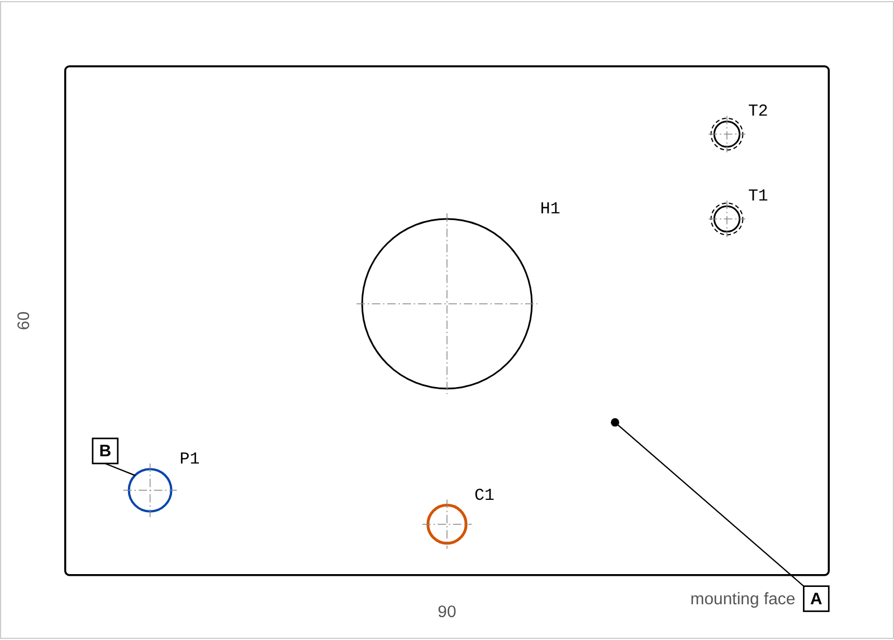

# PMI Assistant


A small Python tool that suggests PMI (Product and Manufacturing Information) for simple machined parts and checks it.

Report for the two sample parts: https://sajin-saji.github.io/pmi-assistant/



## What it does

1. Reads the features of a part from a JSON file: planar faces, bores, pin holes, clearance holes and threaded holes.
2. Picks the datums: A = largest mating face, B and C = the locating pin holes.
3. Suggests PMI from ISO tables:
   - general tolerances ISO 2768-mK
   - H7 (ISO 286) for pin holes and bearing seats
   - clearance holes per ISO 273 medium, toleranced H13 so that MMC = nominal size
   - position tolerance for clearance holes: T = H - F at MMC (floating fastener)
   - position tolerance for threaded holes: T = (H - F) / 2 with projected tolerance zone (fixed fastener)
   - flatness and roughness for mating faces and precision bores
4. Checks the result: missing datums, features without PMI, undefined datum references, holes outside the part, edge distance below 1.5 x D, thin walls between holes.
5. Writes one JSON file per part and an HTML report.

Each suggestion stores the rule it came from, so it can be checked and changed. Values that are not from a standard (flatness, roughness, edge distance) are in `RULESET` in `pmi_assistant/rules.py`.

## Run

Python 3.10 or newer, no extra packages.

```
python -m unittest -v
python -m pmi_assistant samples/*.json --out docs
```

With `--strict` the command fails if a part has validation errors.

## CI

`.github/workflows/ci.yml` runs on every push: unit tests, then the PMI for the sample parts in strict mode, then a check that the report in `docs/` is up to date. The report is published with GitHub Pages from `docs/`.

## Siemens NX

The rules and checks do not depend on where the features come from. In NX the JSON input would be replaced by reading faces and hole features with NXOpen (Python or C#) and writing the result back as PMI. `nx/nx_feature_source_sketch.py` is a first, untested sketch of that (it needs an NX licence).

## Limits

Only flat parts seen from the top, with holes and faces. No slots, counterbores or shafts yet. The suggestions are a first draft for a designer to review. The sample parts are made up.

## Files

```
pmi_assistant/standards.py   ISO 2768-1, ISO 286 (IT7, IT13), ISO 273 tables, fastener formulas
pmi_assistant/model.py       features, annotations, findings, JSON export
pmi_assistant/rules.py       datum selection and PMI rules
pmi_assistant/validate.py    checks
pmi_assistant/report.py      HTML report
samples/                     two sample parts
tests/                       unit tests
docs/                        generated report
nx/                          NXOpen sketch
```
